

  

<h3 align="center">Big Bite</h3>

---

 An online restaurant website was developed to help customers to buy foods .
      

## 📝 Table of Contents

- [About](#about)
- [Getting Started](#getting_started)
- [Usage](#usage)
- [Built Using](#built_using)
- [User Story](#user_story)
- [Data Flow](#data_flow)
- [Guided By](#guided_by)

## 🧐 About 

 An online restaurant website which name is Big Bite was developed to help customers to buy foods and deserts and drinks.
 Also there is an admin side where the admin can add foods, update and delete ,we tryed to make a simple design to help the customers to use the website .

## 🏁 Getting Started 

These instructions will get you a copy of the project up and running on your local machine for development and testing purposes.

### Prerequisites

- VS code <a href="https://code.visualstudio.com/download">download from here</a>
- Git Bash <a href="https://git-scm.com/">download from here</a>
- MySQL <a href="https://dev.mysql.com/downloads/installer/">download from here</a>
- Node.js <a href="https://nodejs.org/en/download/">download from here</a>

### Installing

1. clone the repo to your local machine using git bash.
   git clone https://github.com/HEXTERS-CODER/MERAKI_Academy_Project_5.git

2. install packages repeat this step in backend and frontend folder
   npm i

3. Run the server using git bash inside backend folder
   npm run dev

4. Run application using git bash inside frontend folder
   npm run start

Now App ready to use
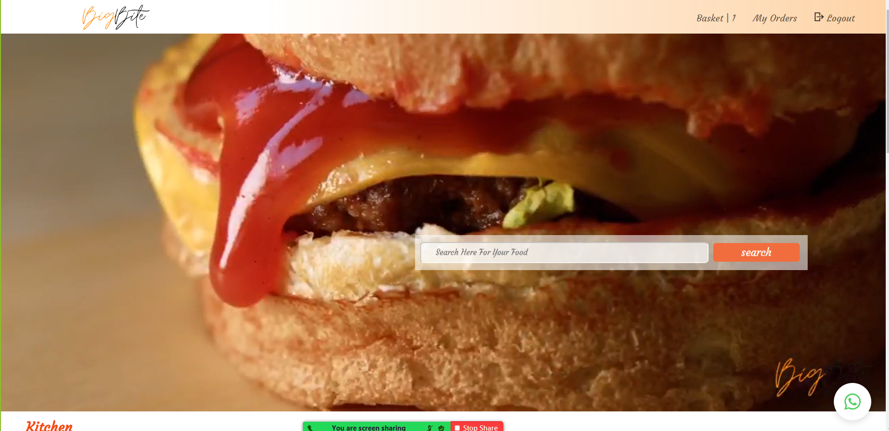

## 🎈 Usage 

* you don't have to register to navigate our web app.

* you can click on the logo provided in the navigation bar to view the home section
  

* you can click on add to cart button to add this product to your cart but you have to be one of our users, so you should craete an account.
  if you have account =>
  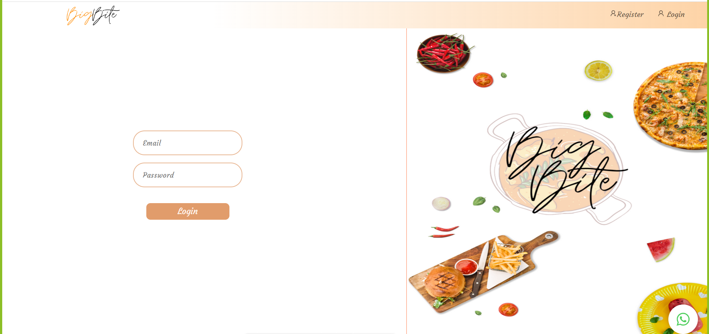
    if you dont have account=>
  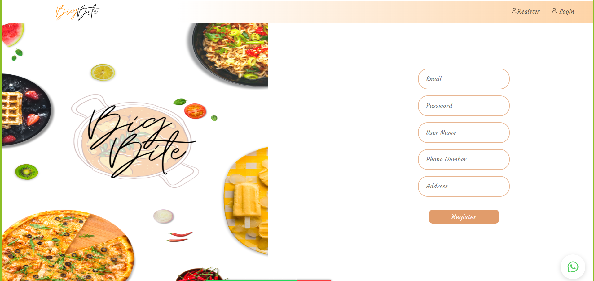
  add to basket=>
  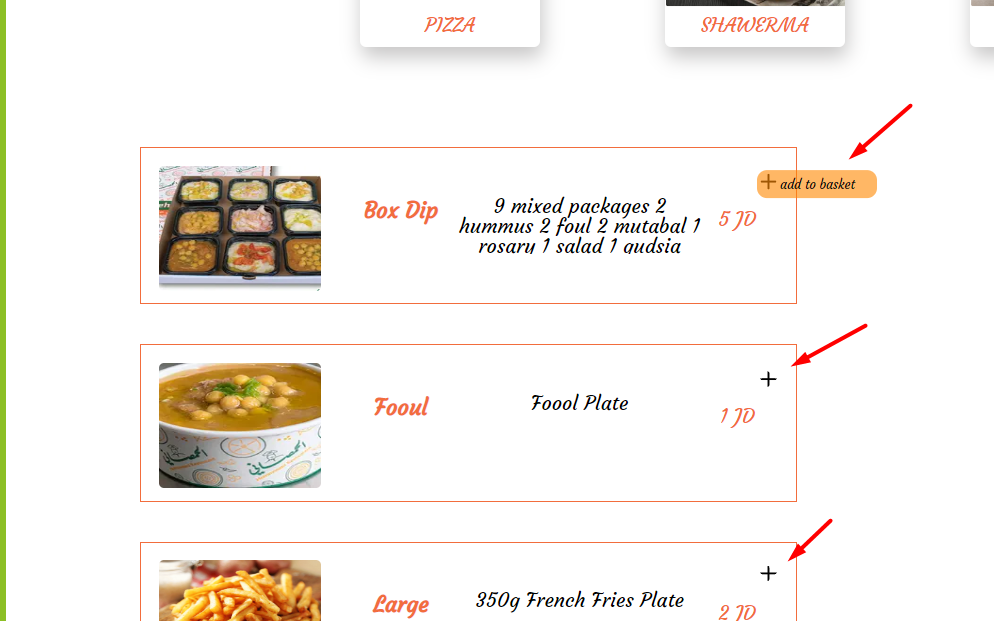
 view product in basket=>
  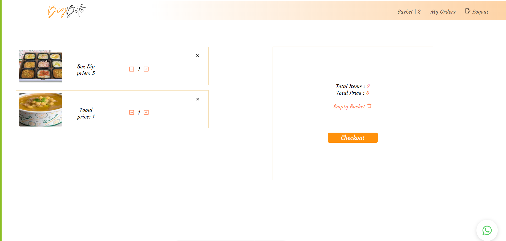

* you can view products in basket and increase and decrease amount and delete them if you want.
    

* you can click on add checkout button to pay the price of your products by paypal.
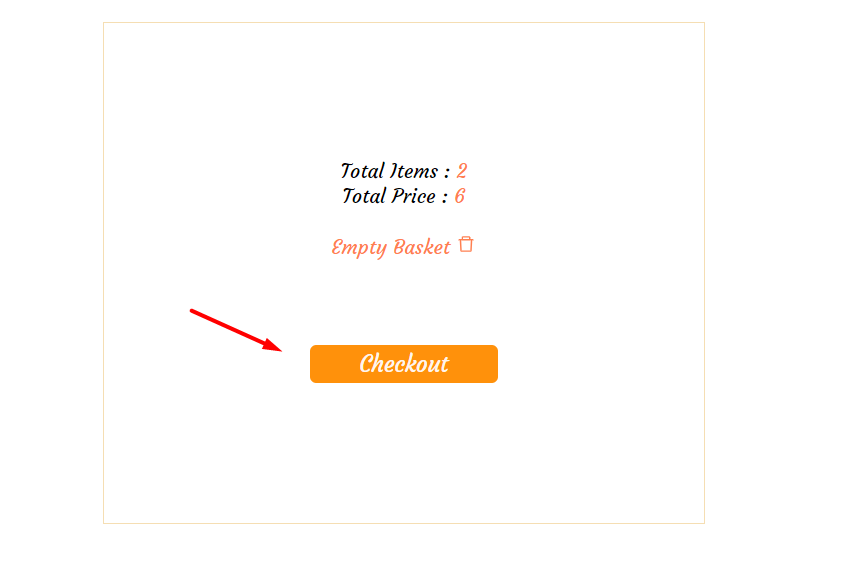
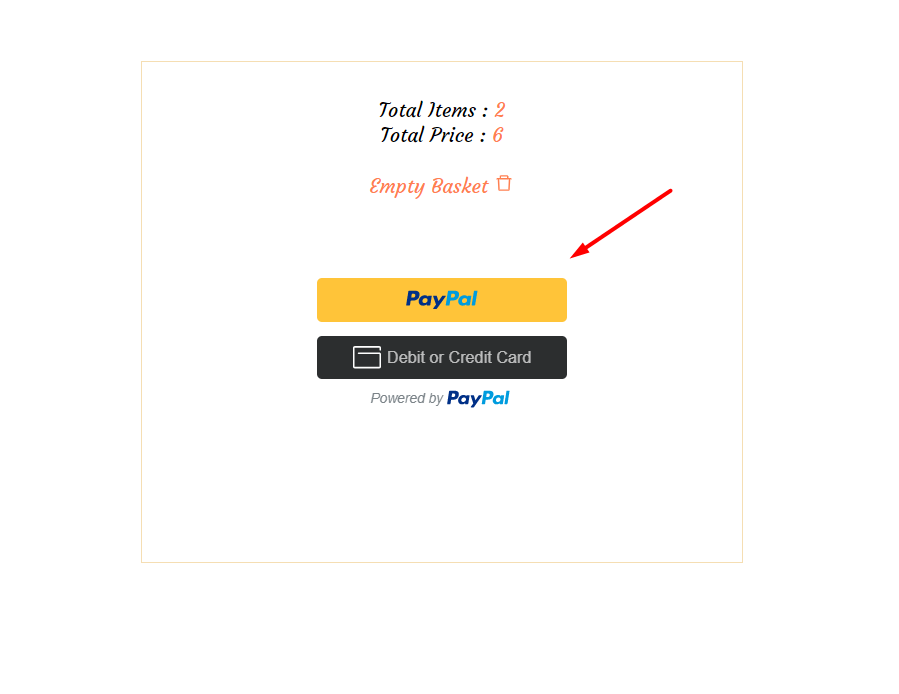

* you can search about products you need.
  

* you can show products by filter (categories)
  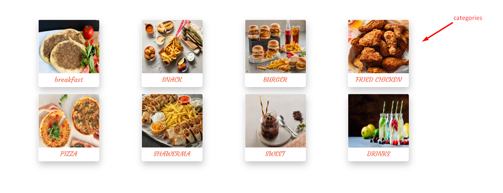

* you can show your orders of products.
  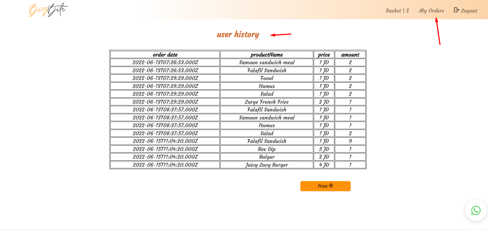

* In the footer there is a contact us you can send your opinion to the restaurants email.
  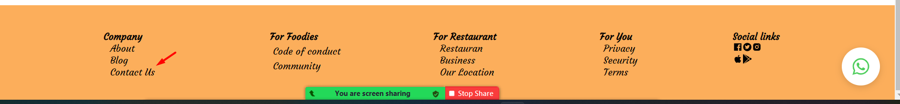
 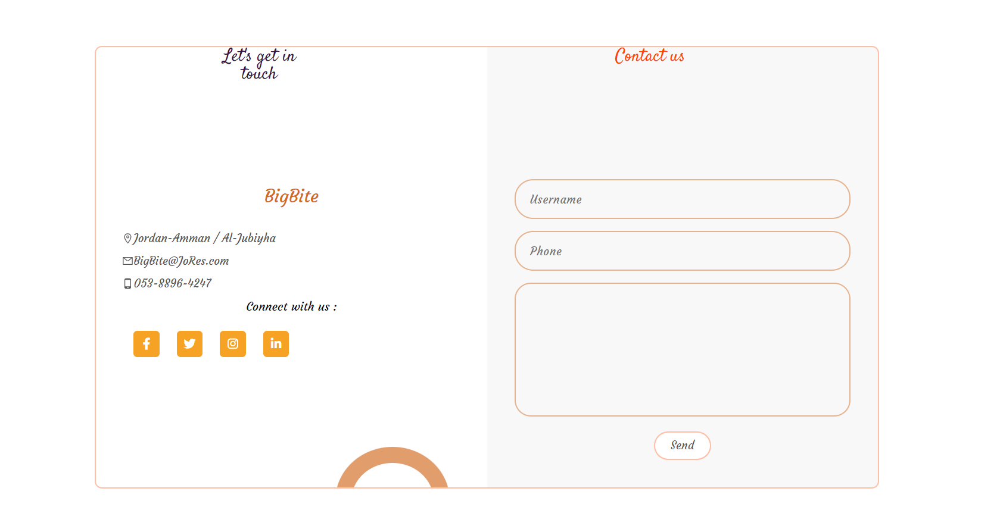

* In the footer there is our location  you can check the location of the restaurants email.
  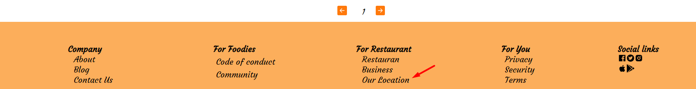
  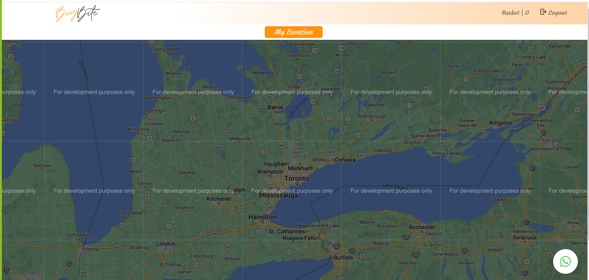

* The Dashboard in the admin side.
  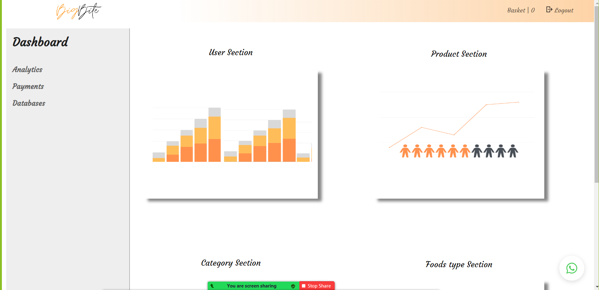

* The User Section in the Dashboard in the admin side.
  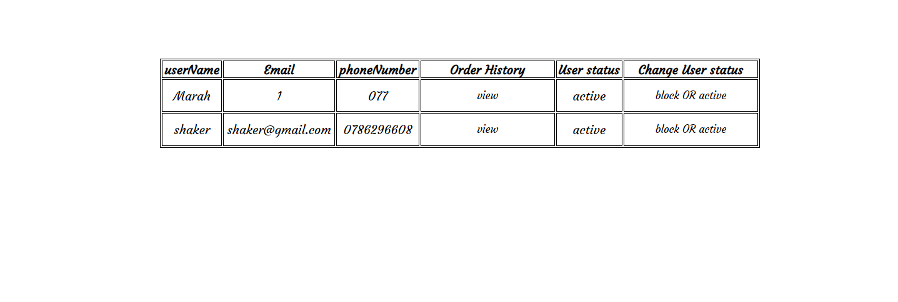

* The Product Section in the Dashboard in the admin side.
  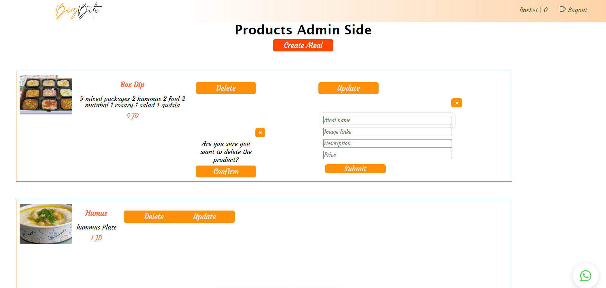

* To Add Product in the Dashboard in the admin side.
  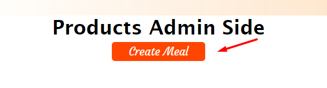
  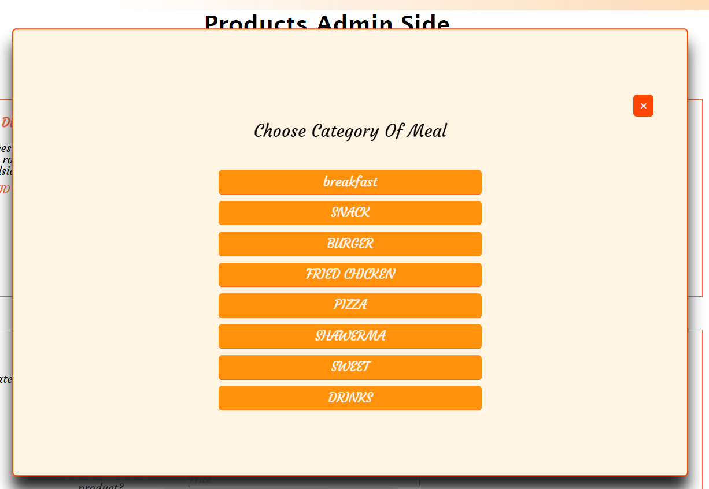

* To delete product in the admin side.
  

* To update product in the admin side.
  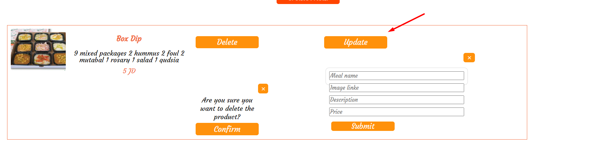

## ⛏️ Built Using 

- [MySQL](https://dev.mysql.com/downloads/installer//) - Database
- [Express JS](https://expressjs.com/) - Server Framework
- [React JS](https://https://reactjs.org/) - Web Framework
- [Node JS](https://nodejs.org/en/) - Server Environment

##  User Story 

-Link of Project 5 Trello
https://trello.com/b/YN7ttSqc/restaurant

##  Data Flow 

  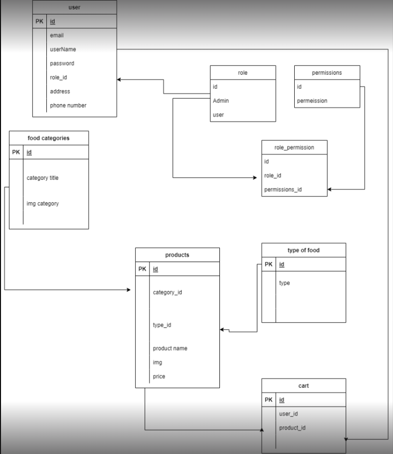

## ⚠️ Guided By 

This project is guided by ©️ **[MERAKI Academy](https://www.meraki-academy.org)**
